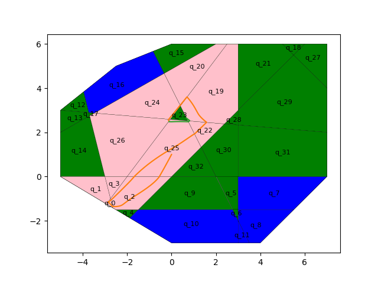

# Description

This repository contains the code for the course project for ASEN 6519 - Hybrid Systems: Theory, computation, and Applications. The main objective of the project is to generate a trajectory for a contorl affine system using feedback control law that satisfies a given specification specificed within the Linear Temporal Logic framework. The specification is usually of the form - visit certain regions-of-interest while avoiding obstacles - thus assuring guarantees with respect to the given specification.

Synthesis of a controller for an affine system with linear dynamics using restricted Linear Temporal Logic formula in python.

**Table of Contents**
* [conda env installation]()
* [About the project]()
* [Approach used]()
* [Results]()

# Instructions to run

Install anaconda on your OS and then run the below mentioned shell commands with conda comand path

##Installing the env 

* Install dependencies - Install conda env

Use the terminal or an Anaconda Prompt for the following steps:

* Create the environment from the environment.yml file under conda/

    ```bash
    conda env create -f environment.yml
    ```

* The first line of the yml file sets the new environment's name. In my case it is `ltl_ctrl_prj`. You could modify it before compiling this file.

* Activate the new environment: note replace myenv with `dl_project_env` 

    ```bash
    conda activate <myenv>
    ```

* Verify that the new environment was installed correctly. You should see a star(`*`) in front the current active env

    ```bash
    conda env list
    ```

* You can also use 
    
    ```bash
    conda info --envs
    ```

## Running the code
s
After activating the env in the prompt, run 

```bash
python3 LTL_ctrl.py. 
``` 

NOTE: Before getting started, please create a empty `frames` directory in the same folerr in which LTL_ctrl.py exists - the root directory of the project. This is necessary for creating animation. The code will fail if such a directory does not exists!

Initially, it will ask for data to be read from? - please select `y` for now! Then when asked for a formula please follow these guidlines:

The formula is an LTL formula, and may contain propositional symbols, boolean operators, temporal operators, and parentheses.

The syntax used is the one used in the 'Spin' model-checker

* Propositonal Symbols:
    true, false
    any lowercase string

* Boolean operators:
    !   (negation)
    ->  (implication)
    <-> (equivalence)
    &&  (and)
    ||  (or)

* Temporal operators:
    []  (always)
    <>  (eventually)
    U   (until)
    V   (release)
    X   (next)

Use spaces between any symbols.

The result is a never claim in Promela that can be given to the Spin model checker to verify properties of a system.

The Formula must be given between apostrophes ('); propositions defined by A and b from before must be denoted by p1, p2, ..., px, where x=N_p; all N_p propositions should appear in formula. For e.g.

```bash
'F (q_0 & q_23)'
```
After the formual is entered, it will go ahead and plot the set of initial states from which it can satisfy the specification(states/polytopes in green) and states from which it cannot (states/polytopes in blue). The trajectory in cyan is the prefix while the gree path is the path that it is repeated infinitely often.


# Introduction

The objective is to find a safe trajectory that satifies the given specification as a LTL formula defined over a set of predicates in its state variables using a feedback control law with polyhedral bounds. 

The approach can be decomposed into three main steps:

1. For a given specification defined over a set of predicates, we partition the state space and construct a transition system (TS).
2. We determine the runs that satify the given specification use model-checking techniques.
3. We generate a controller for a trajectory.

# Approach

The input to the system is the space in which it will operate in - A bounded polytope of N dimension - , for a control affine system givev by


 

where .

Here A is a n x n square matrix, B is a N x m rectangular matrix and b is a n dimenaional flat vector.

For a given specification, the code tries to find a set of initial states and feedback control strategy for the above system whose trajectories always stay within the workspace while satisfying the task. Technically, we check if the word corresponding to the trajectory satisfies the formula or not. 

The system used in the code uses the following dynamics:


the control matrices A, B and b  are hardcoded in the code. The specification is to visit a three specific regions of interest - which are encoded as a set of predicates in the LTL formula. The also exisits few obstacles in the regions. 

# Results

For a given workspace, we plot the boumdaries, the predicates and the possible transitions from each state to its neighbouring states. Solid lines indicate that you can traverse from one polytope's centre to the other. Dotted lines indicate that we can only traverse in one direction. 

The solid black lines represents the drift induced by the system's dynamics.


Plotting the set of valid initial states from which we can achieve the following specification : `F (q_0 & q_23)`. 

* Green - valid initial states
* blue - invalid initial states 

Note: This is not the exact specification used but one that is easy to interpret in this README.


The final trajectory



# DISCLAIMER

Sometimes you might not see any trajectories at all or the trajectory plotted may or may not specifcy the given speciifcation. I will try to fix in the near future. This project is a work in progress and any kind of feedback is welcome!

# Contact

Please reach out to me if you have any question in general at - [karan.muvvala@colorado.edu](mailto:karan.muvvala@colorado.edu). Thank you!